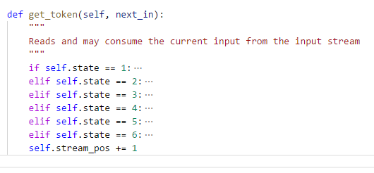

# Compiler Assignment - 1 Scanner
## Name: Abdelrahman Mohamed Abdelhamid Ali Elbehery
## Section : 2
## ID : 1300759

--- 
<!-- TOC -->

## Table of contents

- Compiler Assignment - 1 Scanner 
    - [How to use](#how-to-use)
    - [Class diagram](#class-diagram)
        - [Attributes](#attributes)
        - [Methods](#methods)
    - [Scanner Algorithm](#scanner-algorithm)
    - [Scanner features](#scanner-features)
    - [Testing the output](#testing-the-output)

<!-- /TOC -->

---

## How to use
+ You need a `python 2.7 interpreter`
+ From terminal type `python scanner.py`
    + Note the code assumes a text file `tiny_sample_code.txt` exists at its directory **which is attached on the zip file**
+ The output is generated at a text file `scanner_output.txt`

**Steps with images**

## Class diagram

The code is built upon a single big class `Scanner` which is implemented at `scanner_class.py`. 

### Attributes
- `res_words` : an array of all the reserver words for the language
- `sp_symbols` : an array of all the reserved symbols for the language
- `tokens` : an array of tuples (value, type) of all the collected tokens -with type-
from the file to scan
- `state` : a variable indicating the current state. Negative value for this variable indicates an error; Note : 1 is the input state, 0 is the end state
- `stream_pos` : a variable indicating the index at the input stream character
- `current_token_val` : FSM internal variable to track the 
- `look_up_symbols` : used to lookup for the symbols of the language
- `look_up_numbers` : used to look up for a valid number

### Methods
- `Scanner()` : The class constructor
- `scan()` : The scan algorithm
- `get_token()` : The FSM function

## Scanner Algorithm

The scanner uses the `scan()` function that will attempt to read **each line** in the source code and for each character in the line, it will call the `get_token()` function giving it the character at the current position, the FSM implemented in `get_token()` will either consume this input character or will ignore it; This is done by increasing the current position in the input line.

The `get_token()` function hsa the implementation of the finite automata such that each state is labeled as the following 

Since python does not support the `switch - case` statements, it is implemented using a simple `if - else` where other conditions are nested within each of these conditions as shown below

## Scanner features

+ The implemented scanner is able to tell if a **specific line** has an error, it will tell the user which line contains the error. Example
+ The implemented scanner reserved words and special symbols can be given at instantiation

**Example**

When writing a wrong expression at line `12` the code stops scanning and tells the user at which line the error exist

Now after commenting the whole line 

## Testing the output

For the example at the assignment description, the code spotted all the identifiers, reserved words, numbers and special symbols and the output file was like the following

